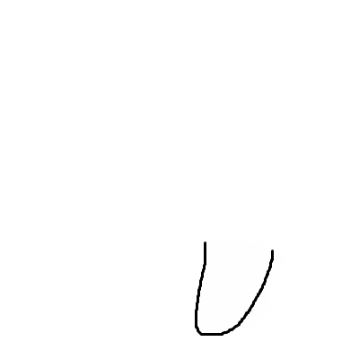
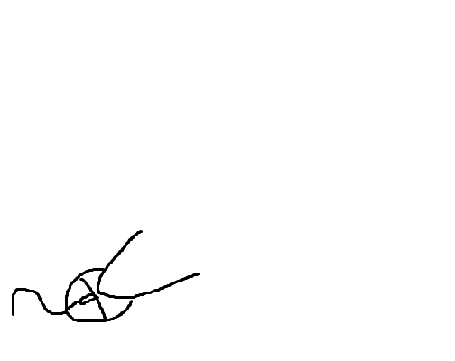
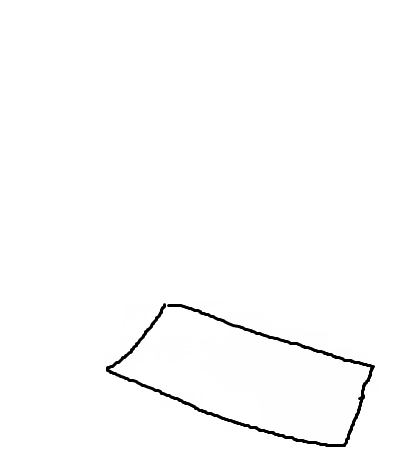
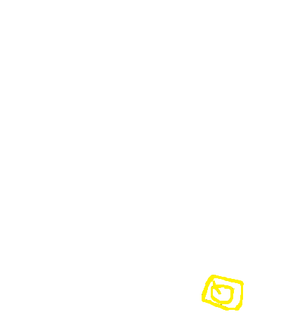

# Avatar — 스트리머용 아바타 오버레이

키보드 입력과 마우스 움직임에 반응하는 투명 오버레이 아바타 앱입니다.  
OBS, XSplit 등 방송 소프트웨어의 **창 캡처**로 바로 사용할 수 있습니다.

---

## 스프라이트 미리보기

| 기본 자세 | 왼팔 내림 | 오른팔 내림 | 마우스 모드 |
|:---------:|:---------:|:-----------:|:-----------:|
|  |  |  |  |

> 왼손 키 → 왼팔 내림 / 오른손 키 → 오른팔 내림 / 마우스 이동 → 마우스 모드 팔로 교체

### 키보드 디스플레이

| 기본 키보드 | 키 미입력 | 키 입력 |
|:-----------:|:---------:|:-------:|
|  |  |  |

---

## 설치 방법

### 방법 1 — 인스톨러 (권장)

1. [Releases](../../releases) 페이지에서 최신 버전의 **`avatar_x.x.x_x64-setup.exe`** 또는 **`avatar_x.x.x_x64_en-US.msi`** 를 다운로드합니다.
2. 파일을 실행합니다.
   - **Windows 보안 경고("Windows가 PC를 보호했습니다")** 가 뜨면 **"추가 정보" → "실행"** 을 클릭합니다.  
     (오픈소스 앱이라 코드 서명 인증서가 없어 발생하는 경고입니다. 소스코드는 이 저장소에서 직접 확인하실 수 있습니다.)
3. 설치 후 시작 메뉴 또는 바탕화면에서 **Avatar** 를 실행합니다.

### 방법 2 — 포터블 EXE

1. [Releases](../../releases) 페이지에서 **`avatar.exe`** 를 다운로드합니다.
2. 원하는 폴더에 놓고 바로 실행합니다. 설치 불필요.

---

## 사용 방법

### 기본 동작

- 앱을 실행하면 화면에 투명 오버레이로 아바타가 표시됩니다.
- 키보드를 누르면 해당 손의 팔이 내려갑니다.
- 마우스를 움직이면 오른팔이 마우스 모드 스프라이트로 전환되고, 마우스 방향으로 팔이 이동합니다.

### 편집 모드

트레이 아이콘 우클릭 → **"설정 열기"** 를 누르면 편집 모드가 활성화됩니다.

| 동작 | 효과 |
|------|------|
| 창 배경 드래그 | 오버레이 창 이동 |
| 창 테두리 드래그 | 오버레이 창 크기 조절 |
| 캐릭터 스프라이트 드래그 | 아바타 위치 조정 |
| 키보드 디스플레이 드래그 | 키보드 위치 조정 |
| 키보드 디스플레이 위에서 스크롤 | 키보드 회전 |

설정창을 닫으면 위치/크기가 자동 저장됩니다.

### OBS 연동

1. OBS에서 **소스 추가 → 창 캡처** 를 선택합니다.
2. 창 목록에서 **Avatar** 를 선택합니다.
3. **"커서 캡처"** 는 비활성화를 권장합니다.

> 투명 배경을 지원하므로 크로마키 없이 알파 채널 그대로 합성됩니다.

---

## 스프라이트 커스터마이즈

설정 파일: `%APPDATA%\avatar\config.toml`

스프라이트 경로를 변경하면 자신만의 캐릭터를 사용할 수 있습니다.

```toml
[sprites]
body        = "C:/MySprites/body.png"
left_arm_up   = "C:/MySprites/left-up.png"
left_arm_down = "C:/MySprites/left-down.png"
right_arm_up  = "C:/MySprites/right-up.png"
right_arm_down= "C:/MySprites/right-down.png"
mouse       = "C:/MySprites/mouse.png"
```

스프라이트는 **400×320 PNG (투명 배경)** 로 제작하는 것을 권장합니다.

---

## 직접 빌드

```bash
# 의존성
npm install

# 개발 모드
npm run tauri dev

# 배포 빌드 (target/release/bundle/ 에 설치 파일 생성)
npm run tauri build
```

Rust 1.70+, Node.js 18+, [Tauri 사전 요구사항](https://tauri.app/start/prerequisites/) 필요.

---

## 라이선스

MIT
